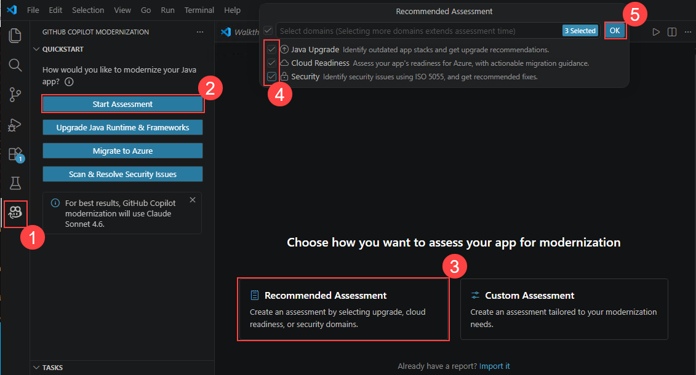
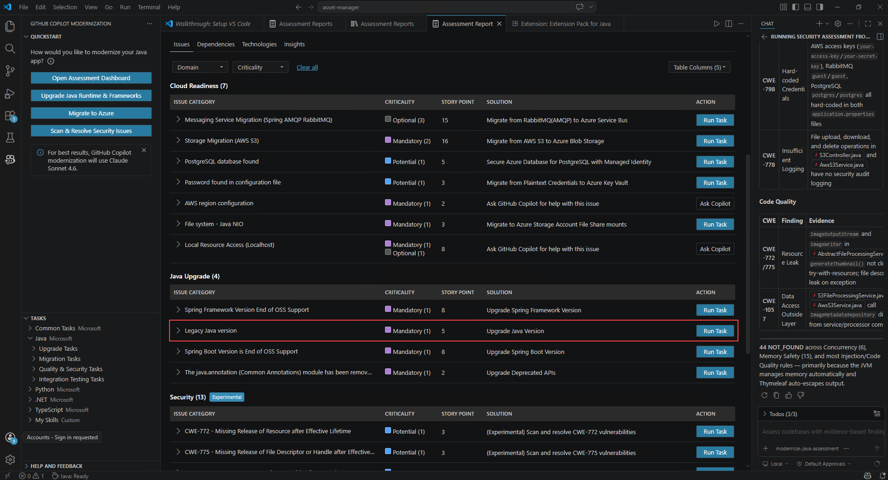
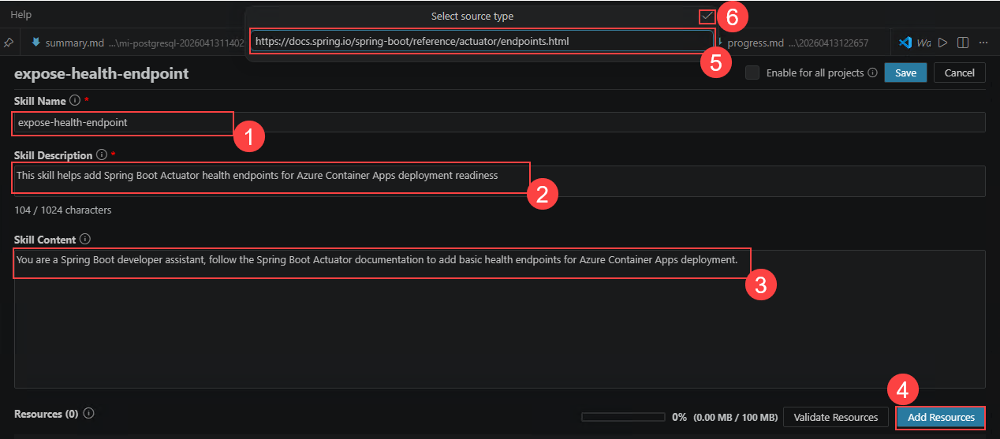
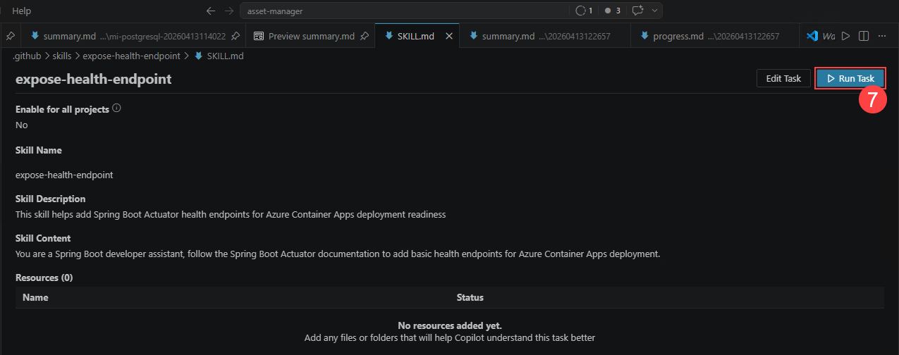
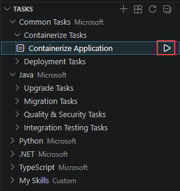
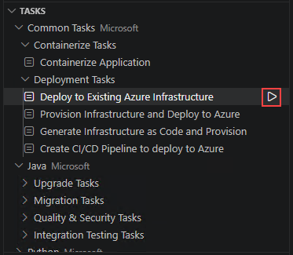
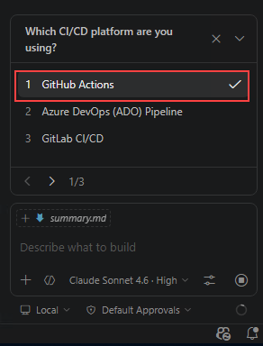
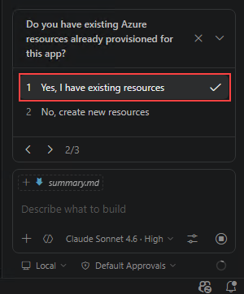
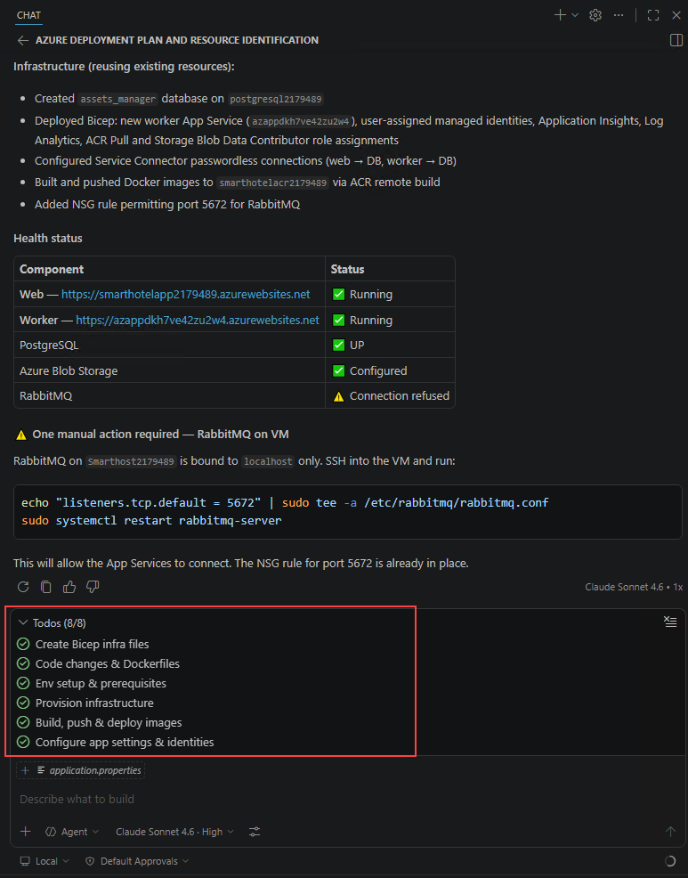

# 실습 4: GitHub Copilot modernization을 활용한 애플리케이션 모더나이제이션

## 개요

이 실습에서는 GitHub Copilot modernization 확장을 사용하여 Java 애플리케이션을 평가, 업그레이드, 마이그레이션하고 최종적으로 Azure에 배포합니다.

모더나이제이션 프로세스는 오래된 기술 기반의 애플리케이션을 최신 Azure 네이티브 솔루션으로 전환합니다. 여기에는 Java 8에서 Java 21로의 업그레이드, Spring Boot 2.x에서 3.x로의 마이그레이션, AWS S3를 Azure Blob Storage로 교체, RabbitMQ를 Azure Service Bus로 전환, Azure Database for PostgreSQL로의 마이그레이션, 관리 ID 인증 구현, 헬스 체크 추가, 애플리케이션 컨테이너화, 그리고 적절한 모니터링을 갖춘 클라우드 배포 준비가 포함됩니다.

## 목차

- [개요](#개요)
- [앱 모더나이제이션](#앱-모더나이제이션)
  - [GitHub Copilot modernization 설치](#github-copilot-modernization-설치)
  - [Java 애플리케이션 평가](#java-애플리케이션-평가)
  - [런타임 및 프레임워크 업그레이드](#런타임-및-프레임워크-업그레이드)
  - [사전 정의된 작업을 사용하여 Azure Database for PostgreSQL Flexible Server로 마이그레이션](#사전-정의된-작업을-사용하여-azure-database-for-postgresql-flexible-server로-마이그레이션)
  - [사전 정의된 작업을 사용하여 Azure Blob Storage로 마이그레이션](#사전-정의된-작업을-사용하여-azure-blob-storage로-마이그레이션)
  - [사전 정의된 작업을 사용하여 Azure Service Bus로 마이그레이션](#사전-정의된-작업을-사용하여-azure-service-bus로-마이그레이션)
  - [Custom Skills를 사용하여 헬스 엔드포인트 노출](#custom-skills를-사용하여-헬스-엔드포인트-노출)
  - [애플리케이션 컨테이너화](#애플리케이션-컨테이너화)
  - [Azure에 배포](#azure에-배포)

## 앱 모더나이제이션

다음 섹션에서는 GitHub Copilot modernization을 사용하여 샘플 Java 애플리케이션 asset-manager를 Azure로 모더나이즈하는 과정을 안내합니다.

### GitHub Copilot modernization 설치

VS Code에서 Activity Bar의 Extensions 뷰를 열고, 마켓플레이스에서 GitHub Copilot modernization 확장을 검색합니다. 해당 확장의 **Install** 버튼을 클릭합니다. 설치가 완료되면 VS Code 오른쪽 하단에 설치 성공을 확인하는 알림이 표시됩니다.

### Java 애플리케이션 평가

첫 번째 단계는 샘플 Java 애플리케이션 asset-manager를 평가하는 것입니다. 평가를 통해 애플리케이션의 Azure 마이그레이션 준비 상태에 대한 인사이트를 확인할 수 있습니다.

1. 모든 사전 요구 사항이 설치된 상태에서 asset-manager 디렉터리로 이동하고 해당 디렉터리에서 `code .`를 실행하여 VS Code를 엽니다.

2. Activity 사이드바에서 GitHub Copilot modernization 확장 패널을 엽니다.

3. **QUICKSTART** 섹션에서 **Start Assessment**를 클릭하여 앱 평가를 시작합니다.

   

4. **Recommanded Assessment**를 선택한 다음, 팝업에서 기본 선택값인 **Java Upgrade** 및 **Cloud readiness**를 그대로 유지하고 **ok**을 클릭합니다.

5. 평가가 시작되었으면 완료될 때까지 기다립니다. 이 단계는 몇 분 정도 소요될 수 있습니다.

6. 완료되면 **Assessment Report** 탭이 열립니다. 이 보고서는 클라우드 준비 상태 이슈와 권장 솔루션을 분류된 형태로 제공합니다. **Issues** 탭을 선택하여 제안된 솔루션을 확인하고 마이그레이션 단계를 진행합니다.

### 런타임 및 프레임워크 업그레이드

1. Issues 탭 하단의 **Java Upgrade** 테이블에서 첫 번째 항목인 **Java Version Upgrade**의 **Run Task** 버튼을 클릭합니다.

   

2. **Run Task** 버튼을 클릭하면 Agent Mode로 Copilot Chat 패널이 열립니다. 에이전트가 새 브랜치를 체크아웃하고 JDK 버전 및 Spring/Spring Boot 프레임워크 업그레이드를 시작합니다. 에이전트의 모든 요청에 대해 **Allow**를 클릭합니다. 작업 실행 중 에이전트가 몇 가지 확인을 요청할 수 있으며, 해당 세션에서 이를 허용할 수 있습니다.

   > **참고:** 업그레이드 도구는 최신 LTS 버전인 JDK 25로의 업그레이드도 지원합니다. 이를 수행하려면 생성된 채팅 메시지를 클릭하고 대상 Java 버전을 25로 편집한 다음 Send를 클릭하여 변경 사항을 적용합니다.

3. 업그레이드에는 최대 5분이 소요될 수 있습니다. 그동안 대시보드를 더 탐색할 수 있으며, 완료되면 다음 작업을 계속 진행할 수 있습니다.

### 사전 정의된 작업을 사용하여 Azure Database for PostgreSQL Flexible Server로 마이그레이션

이제 샘플 Java 애플리케이션 asset-manager를 Azure로 마이그레이션할 수 있습니다.

1. 이 워크숍에서는 Solution 목록에서 **Migrate to Azure Database for PostgreSQL (Spring)**을 선택한 다음 **Run Task**를 클릭합니다.

   

2. Assessment Report에서 **Run Task** 버튼을 클릭하면 Agent Mode로 Copilot Chat 패널이 열립니다.

3. Copilot Agent가 프로젝트를 분석하고 `plan.md` 및 `progress.md`를 생성하여 열린 다음, 자동으로 마이그레이션 프로세스를 진행합니다.

4. 에이전트는 버전 관리 시스템 상태를 확인하고 마이그레이션을 위한 새 브랜치를 체크아웃한 후 코드 변경을 수행합니다. 에이전트의 모든 도구 호출 요청에 대해 **Allow**를 클릭합니다.

5. 코드 마이그레이션이 완료되면 에이전트가 자동으로 검증 및 수정 반복 루프를 실행합니다. 이 루프에는 다음이 포함됩니다:

   - **CVE 검증:** 현재 종속성에서 공통 취약점 및 노출을 탐지하고 수정합니다.
   - **빌드 검증:** 빌드 오류를 해결하려고 시도합니다.
   - **일관성 검증:** 기능적 일관성을 위해 코드를 분석합니다.
   - **테스트 검증:** 단위 테스트를 실행하고 실패한 테스트를 자동으로 수정합니다.
   - **완전성 검증:** 초기 코드 마이그레이션에서 누락된 마이그레이션 항목을 찾아 수정합니다.

6. 모든 검증이 완료되면 에이전트가 최종 단계로 `summary.md`를 생성합니다.

7. 제안된 코드 변경 사항을 검토하고 **Keep**을 클릭하여 적용합니다.

### 사전 정의된 작업을 사용하여 Azure Blob Storage로 마이그레이션

1. Assessment Report에서 **Storage Migration (AWS S3) - Migrate from AWS S3 to Azure Blob Storage** 행 오른쪽의 **Run Task**를 클릭합니다.

2. 이후 단계는 위의 PostgreSQL 서버 마이그레이션과 동일합니다.

### 사전 정의된 작업을 사용하여 Azure Service Bus로 마이그레이션

1. Assessment Report에서 **Messaging Service Migration (Spring AMQP RabbitMQ) - Migrate from RabbitMQ(AMQP) to Azure Service Bus** 행 오른쪽의 **Run Task**를 클릭합니다.

2. 이후 단계는 위의 PostgreSQL 서버 마이그레이션과 동일합니다.

### Custom Skills를 사용하여 헬스 엔드포인트 노출

이 섹션에서는 코드를 직접 작성하는 대신 Custom Skills를 사용하여 애플리케이션의 헬스 엔드포인트를 노출합니다. 다음 단계에서는 참조 자료와 적절한 프롬프트를 사용하여 Custom Skill을 생성하는 방법을 설명합니다.

> **참고:** Custom Skills (My Skills)는 IntelliJ IDEA 플러그인에서 지원되지 않습니다. IntelliJ IDEA를 사용하는 경우 이 섹션을 건너뛸 수 있습니다.

1. Activity 사이드바에서 GitHub Copilot modernization 확장 패널을 엽니다. **TASKS** 섹션 위에 마우스를 올리고 **Create a Custom Skill**을 선택합니다.

   

2. 다음 필드가 포함된 **Create a Skill** 폼이 열립니다. 아래와 같이 입력합니다:

   - **Skill Name:** `expose-health-endpoint`
   - **Skill Description:** `This skill helps add Spring Boot Actuator health endpoints for Azure Container Apps deployment readiness.`
   - **Skill Content:** `You are a Spring Boot developer assistant, follow the Spring Boot Actuator documentation to add basic health endpoints for Azure Container Apps deployment.`

   

3. **Add Resources**를 클릭하여 Spring Boot Actuator 공식 문서를 리소스로 추가합니다. 다음 링크를 붙여넣습니다: `https://docs.spring.io/spring-boot/reference/actuator/endpoints.html`

4. **Save**를 클릭하여 스킬을 생성합니다. 생성된 Custom Skill은 **TASKS > My Skills** 섹션에 표시됩니다.

5. **Run**을 클릭하여 실행합니다.

6. Copilot Chat 창이 Agent Mode로 열리고 자동으로 마이그레이션 계획을 생성하며, 새 브랜치를 체크아웃하고, 코드 변경을 수행한 다음, 검증 및 수정 반복 루프를 실행합니다. 에이전트의 모든 도구 호출 요청에 대해 **Allow**를 클릭합니다.

7. 제안된 코드 변경 사항을 검토하고 **Keep**을 클릭하여 적용합니다.

### 애플리케이션 컨테이너화

Java 애플리케이션이 Azure 서비스를 사용하도록 성공적으로 마이그레이션되었으므로, 다음 단계는 web 및 worker 모듈을 컨테이너화하여 클라우드 배포를 준비하는 것입니다. 이 섹션에서는 Containerization Tasks를 사용하여 마이그레이션된 애플리케이션을 컨테이너화합니다.

> **참고:** 이전 마이그레이션 단계에서 문제가 발생한 경우, `workshop/expected` 브랜치를 사용하여 컨테이너화 단계를 직접 진행할 수 있습니다.

1. Activity 사이드바에서 GitHub Copilot modernization 확장 패널을 엽니다. **TASKS** 섹션에서 **Common Tasks > Containerize Tasks**를 확장하고 **Containerize Application**의 실행 버튼을 클릭합니다.

   

2. Agent Mode로 Copilot Chat 패널에 사전 정의된 프롬프트가 입력됩니다. Copilot Agent가 워크스페이스를 분석하고 컨테이너화 계획이 포함된 `containerization-plan.copilotmd`를 생성합니다.

   

3. 계획을 확인하고, Copilot Agent가 계획의 Execution Steps를 따르는 동안 팝업 채팅 알림에서 **Continue/Allow**를 클릭하여 명령을 실행합니다. 일부 실행 단계에서는 Container Assist의 에이전트 도구를 활용합니다.

4. Copilot Agent가 Dockerfile을 생성하고, Docker 이미지를 빌드하며, 빌드 오류가 있는 경우 수정합니다. **Keep**을 클릭하여 생성된 코드를 적용합니다.

### Azure에 배포

이 시점에서 샘플 Java 애플리케이션 asset-manager를 Azure Database for PostgreSQL (Spring), Azure Blob Storage, Azure Service Bus로 성공적으로 마이그레이션하고 Spring Boot Actuator를 통해 헬스 엔드포인트를 노출했습니다. 이제 Azure에 배포를 시작할 수 있습니다.

> **참고:** 이전 마이그레이션 단계에서 문제가 발생한 경우, `workshop/deployment-expected` 브랜치를 사용하여 배포 단계를 직접 진행할 수 있습니다.

1. Activity 사이드바에서 GitHub Copilot modernization 확장 패널을 엽니다. **TASKS** 섹션에서 **Common Tasks > Deployment Tasks**를 확장합니다. **Provision Infrastructure and Deploy to Azure**의 실행 버튼을 클릭합니다.

   

2. Agent Mode로 Copilot Chat 패널에 사전 정의된 프롬프트가 입력됩니다. 기본 호스팅 Azure 서비스는 Azure Container Apps입니다. 호스팅 서비스를 Azure Kubernetes Service (AKS)로 변경하려면 Copilot Chat 패널의 프롬프트를 클릭하고 프롬프트 마지막 문장을 `Hosting service: AKS`로 편집합니다.

   

3. Copilot Agent가 프로젝트를 분석하고 Azure 리소스 아키텍처, 프로젝트에 권장되는 Azure 리소스 및 보안 구성, 배포 실행 단계가 포함된 `plan.copilotmd` 배포 계획을 생성하도록 팝업 알림에서 **Continue/Allow**를 클릭합니다.

4. 계획에서 아키텍처 다이어그램, 리소스 구성 및 실행 단계를 확인합니다. **Keep**을 클릭하여 계획을 저장한 다음 `Execute the plan`을 입력하여 배포를 시작합니다.

   

5. 프롬프트가 표시되면 채팅 알림에서 **Continue/Allow**를 클릭하거나 터미널에서 `y/yes`를 입력합니다. Copilot Agent가 계획을 따르면서 에이전트 도구를 활용하여 프로비저닝 및 배포 스크립트를 생성하고 실행하며, 잠재적인 오류를 수정하고, 배포를 완료합니다. `progress.copilotmd`에서 배포 상태를 확인할 수도 있습니다. 프로비저닝 또는 배포 스크립트가 실행 중일 때는 **중단하지 마십시오**.

   

   > **참고:** 배포 단계에서 문제가 발생하면 `workshop/deployment-expected` 브랜치의 `/.azure` 폴더에 있는 예상 Copilot 생성 배포 스크립트를 참조하여 배포 스크립트를 비교하고 문제를 해결할 수 있습니다.

### 리소스 정리

더 이상 필요하지 않은 경우, 다음 스크립트를 사용하여 관련된 모든 리소스를 삭제할 수 있습니다.

**Windows:**
```
scripts\cleanup-azure-resources.cmd -ResourceGroupName <your resource group name>
```

**Linux:**
```
scripts/cleanup-azure-resources.sh -ResourceGroupName <your resource group name>
```

GitHub Codespaces를 사용하여 앱을 배포한 경우, GitHub에서 포크된 리포지토리로 이동하여 **Code > Codespaces > Delete**를 선택하여 Codespaces 환경을 삭제합니다.

### 요약

이 실습에서는 GitHub Copilot modernization 확장을 사용하여 Java 애플리케이션 asset-manager를 Azure로 모더나이즈했습니다. 애플리케이션 평가, Java/프레임워크 업그레이드, Azure Database for PostgreSQL·Azure Blob Storage·Azure Service Bus로의 마이그레이션, Custom Skills를 통한 헬스 엔드포인트 노출, 애플리케이션 컨테이너화, 그리고 Azure 배포까지 전체 과정을 완료했습니다.

---

**[← 이전: 실습 3 - 엔터프라이즈 랜딩 존 및 마이그레이션](Exercise3.md)** | **[다음: 실습 5 - CI/CD 자동화 및 배포 →](Exercise5.md)**
