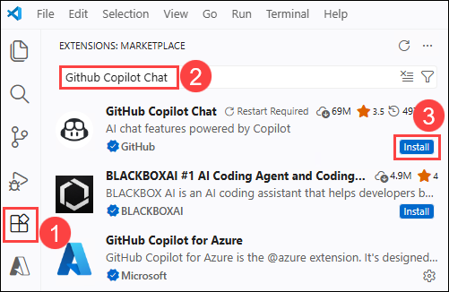
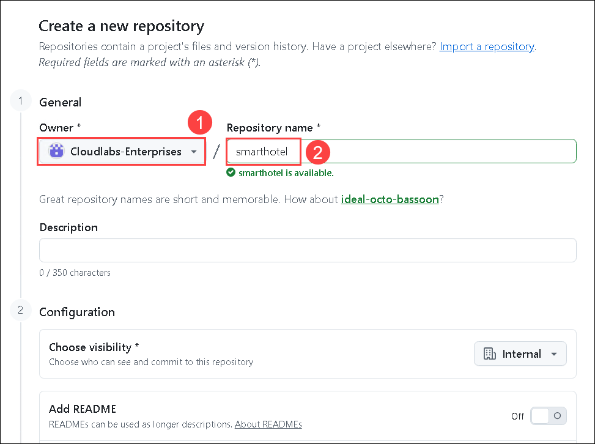
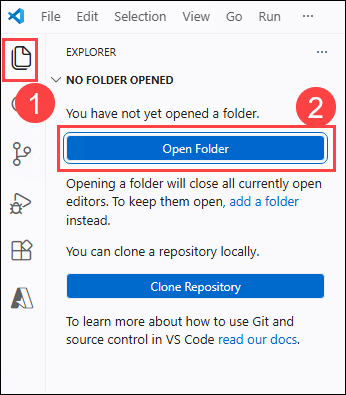
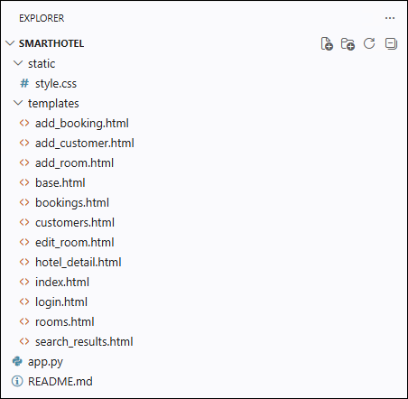
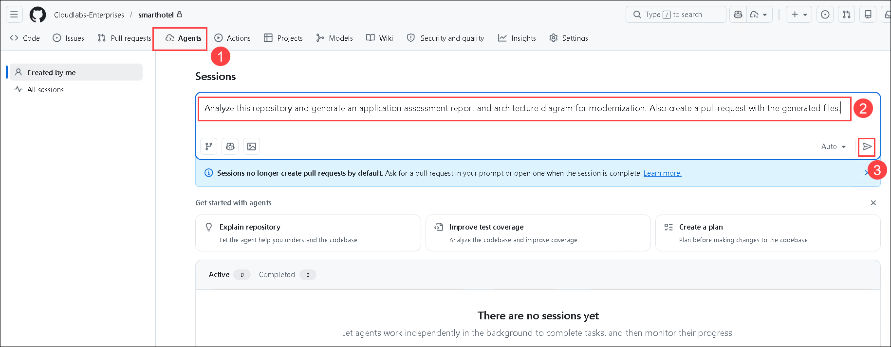
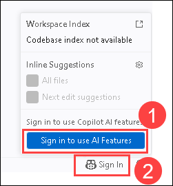
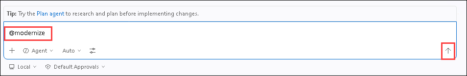
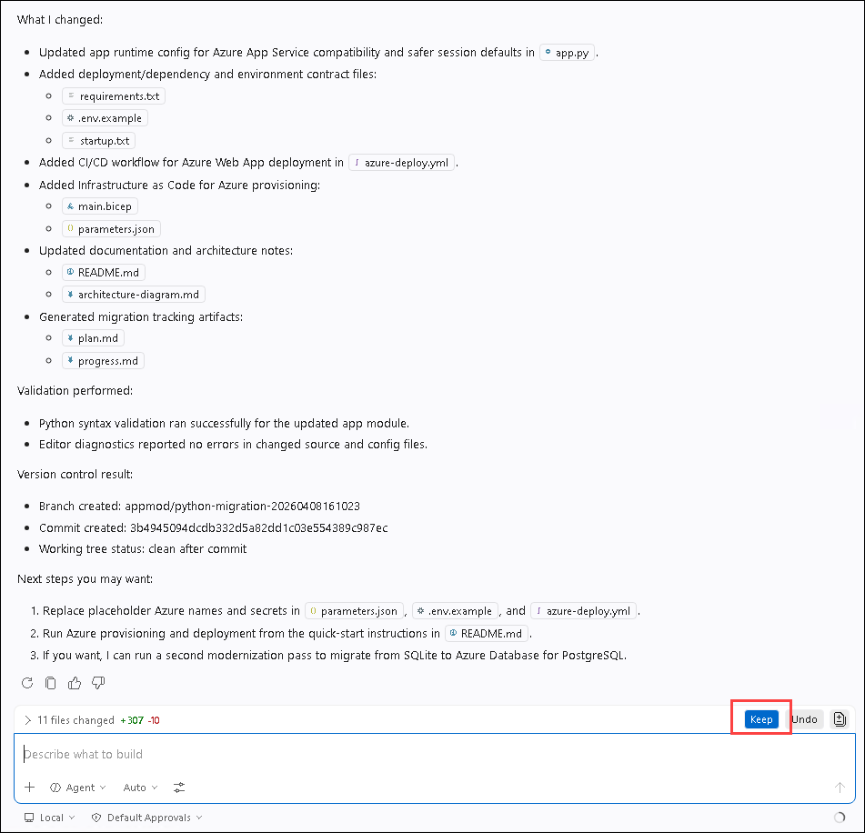
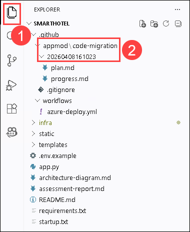
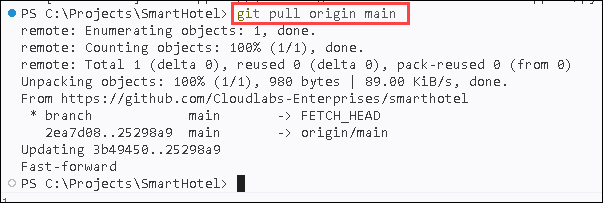

# 실습 4: GitHub Copilot modernization을 활용한 애플리케이션 모더나이제이션

## 개요

이 문서는 GitHub Copilot modernization을 사용하여 Java 애플리케이션을 Azure로 마이그레이션하는 과정을 안내하는 종합 워크숍 가이드입니다. 이 실습에서는 평가, Java/프레임워크 업그레이드, Azure 서비스로의 마이그레이션, 컨테이너화 및 배포를 다룹니다.

**모더나이제이션 프로세스가 수행하는 작업:** 모더나이제이션은 오래된 기술 기반의 애플리케이션을 최신 Azure 네이티브 솔루션으로 전환합니다. 여기에는 Java 8에서 Java 21로의 업그레이드, Spring Boot 2.x에서 3.x로의 마이그레이션, AWS S3를 Azure Blob Storage로 교체, RabbitMQ를 Azure Service Bus로 전환, Azure Database for PostgreSQL로의 마이그레이션, 관리 ID 인증 구현, 헬스 체크 추가, 애플리케이션 컨테이너화, 그리고 적절한 모니터링을 갖춘 클라우드 배포 준비가 포함됩니다.

> **참고:** Copilot Agent가 프롬프트를 따라 실행하는 동안 명령을 실행하기 위한 팝업 채팅 알림에서 **Continue** / **Allow** / **Allow this time** / **Allow in this session**을 클릭하여 권한을 부여하십시오. VS Code 오른쪽 하단에 추가 확장 설치 요청이 나타나면 **Install**을 클릭하십시오.

## 실습 목표

이 실습에서는 다음 작업을 완료합니다:

- 작업 1: Visual Studio Code에서 GitHub Copilot 모더나이제이션 구성
- 작업 2: 앱 모더나이제이션

## 작업 1: Visual Studio Code에서 GitHub Copilot 모더나이제이션 구성

이 작업에서는 Visual Studio Code에서 GitHub Copilot 확장을 설치하고 로그인하여 AI 기반 개발 기능을 활성화합니다.

1. Visual Studio Code에서 왼쪽 사이드바의 **Extensions (1)** 아이콘을 클릭하거나 `Ctrl+Shift+X`를 누릅니다. 검색창에 **GitHub Copilot Chat (2)**를 입력하고 **GitHub Copilot Chat** 확장에서 **Install (3)**을 클릭합니다. 이미 설치되어 있는 경우 무시하십시오.

    

1. Extensions에서 **GitHub Copilot (1)**을 검색하고 목록에서 **GitHub Copilot modernization (2)**을 선택한 다음 **Install (3)**을 클릭합니다.

    

1. **Terminal (1)** 옵션으로 이동하여 **New terminal (2)**을 클릭합니다.

    

1. 다음 명령을 실행하여 애플리케이션 디렉토리로 이동합니다.

    ```bash
    cd \
    ```

1. 아래 명령을 실행하여 리포지토리를 클론하고 asset-manager 폴더를 열어 현재 프로젝트를 로컬에서 실행합니다.

    ```bash
    git clone https://github.com/Cloudlabs-git/java-migration-copilot-samples.git
    ```

    ```bash
    cd java-migration-copilot-samples/asset-manager
    ```

    ```bash
    scripts\startapp.cmd
    ```

## 작업 2: 앱 모더나이제이션

다음 섹션에서는 GitHub Copilot modernization을 사용하여 샘플 Java 애플리케이션 `asset-manager`를 Azure로 모더나이즈하는 과정을 안내합니다.

### Java 애플리케이션 평가

첫 번째 단계는 샘플 Java 애플리케이션 `asset-manager`를 평가하는 것입니다. 평가를 통해 애플리케이션의 Azure 마이그레이션 준비 상태에 대한 인사이트를 확인할 수 있습니다.

1. 모든 사전 요구 사항이 설치된 상태에서 VS Code를 열기 위해 `asset-manager` 디렉터리에서 다음 명령을 실행합니다.

    ```bash
    cd .
    ```

    ```bash
    code .
    ```

1. **Yes, I trust the authors**를 클릭합니다.

    

1. Activity 사이드바에서 **GitHub Copilot modernization (1)** 확장 패널을 엽니다. **QUICKSTART** 섹션에서 **Start Assessment (2)**를 클릭하고 **Recommended Assessment (3)**를 선택합니다. 기본 체크박스 선택값 **(4)**을 그대로 유지하고 **OK (5)**를 클릭하여 앱 평가를 시작합니다. 시간 절약을 위해 보안 체크박스는 건너뛸 수 있습니다.

    > **참고:** GitHub Copilot Chat이 비활성화되어 있는 경우 확장을 활성화한 후 계속 진행하십시오.

    

1. **STATUS (1)** 및 Copilot Chat 출력 **(2)**에서 평가 진행 상황을 모니터링할 수 있습니다. Report Name **(3)**을 클릭하여 보고서를 확인합니다.

    

1. **Target Service**가 **Azure App Service**로 설정된 것을 확인합니다. 평가가 완료될 때까지 기다립니다. 이 단계는 몇 분 정도 소요될 수 있습니다.

    

1. 완료되면 **Assessment Report**가 표시됩니다. 이 보고서는 클라우드 준비 상태 이슈와 권장 솔루션을 분류된 형태로 제공합니다. **Issues** 탭을 선택하여 제안된 솔루션을 확인하고 마이그레이션 단계를 진행합니다.

    

    > **참고:** Copilot Agent가 **Execution Steps**를 따르는 동안 팝업 채팅 알림에서 **Continue/Allow/Keep**을 클릭하여 명령을 실행하도록 허용하십시오. 프롬프트를 검토하고 필요한 입력을 제공합니다. Copilot Agent가 Dockerfile을 생성하고, Docker 이미지를 빌드하며, 빌드 오류가 있는 경우 수정합니다. **Keep**을 클릭하여 생성된 코드를 적용합니다.

### 런타임 및 프레임워크 업그레이드

1. GitHub Copilot modernization 왼쪽 패널에서 **Upgrade Java Runtime & Frameworks**를 선택하면 채팅 창이 기존 프롬프트와 함께 열리고 작업을 시작합니다.

    

1. 에이전트가 새 브랜치를 체크아웃하고 JDK 버전 업그레이드를 시작합니다. 에이전트의 모든 요청에 대해 **Allow**를 클릭합니다. 작업 실행 중 에이전트가 Java 버전 선택 등 몇 가지 확인을 요청할 수 있으며, 해당 세션에서 이를 허용할 수 있습니다.

    > **참고:** 업그레이드 도구는 최신 LTS 버전인 JDK로의 업그레이드도 지원합니다. 이를 수행하려면 생성된 채팅 메시지를 클릭하고 대상 Java 버전을 25로 편집한 다음 **Send**를 클릭하여 변경 사항을 적용합니다.

    

1. 업그레이드에는 최대 5분이 소요될 수 있습니다. 그동안 대시보드를 더 탐색할 수 있으며, 완료되면 다음 작업을 계속 진행할 수 있습니다.

### 작업 3: 데이터베이스 모더나이제이션

이 섹션에서는 데이터를 Azure PostgreSQL로 마이그레이션하고 모더나이즈합니다.

1. Issue에서 **PostgreSQL Database found** 항목의 **Run Task**를 클릭하여 데이터베이스 모더나이제이션을 계획합니다. 클릭하면 채팅 창이 열리고 데이터베이스 마이그레이션 프롬프트가 전송됩니다.

    

1. Copilot Agent가 프로젝트를 분석하고 `plan.md` 및 `progress.md`를 생성하여 열린 다음, 자동으로 마이그레이션 프로세스를 진행합니다.

1. 에이전트는 버전 관리 시스템 상태를 확인하고 마이그레이션을 위한 새 브랜치를 체크아웃한 후 코드 변경을 수행합니다. 에이전트의 모든 도구 호출 요청에 대해 **Allow**를 클릭합니다. 코드 마이그레이션이 완료되면 에이전트가 자동으로 검증 및 수정 반복 루프를 실행합니다. 이 루프에는 다음이 포함됩니다:

    - **CVE 검증:** 현재 종속성에서 공통 취약점 및 노출을 탐지하고 수정합니다.
    - **빌드 검증:** 빌드 오류를 해결하려고 시도합니다.
    - **일관성 검증:** 기능적 일관성을 위해 코드를 분석합니다.
    - **테스트 검증:** 단위 테스트를 실행하고 실패한 테스트를 자동으로 수정합니다.
    - **완전성 검증:** 초기 코드 마이그레이션에서 누락된 마이그레이션 항목을 찾아 수정합니다.
    - 모든 검증이 완료되면 에이전트가 최종 단계로 `summary.md`를 생성합니다.

1. 제안된 코드 변경 사항을 검토하고 **Keep**을 클릭하여 적용합니다.

### 작업 4: Custom Skills를 사용하여 헬스 엔드포인트 노출

이 섹션에서는 코드를 직접 작성하는 대신 Custom Skills를 사용하여 애플리케이션의 헬스 엔드포인트를 노출합니다. 다음 단계에서는 참조 자료와 적절한 프롬프트를 사용하여 Custom Skill을 생성하는 방법을 설명합니다.

> **참고:** Custom Skills (My Skills)는 IntelliJ IDEA 플러그인에서 지원되지 않습니다. IntelliJ IDEA를 사용하는 경우 이 섹션을 건너뛸 수 있습니다.

1. Activity 사이드바에서 **GitHub Copilot modernization** 확장 패널을 엽니다. **TASKS** 섹션 위에 마우스를 올리고 **Create a Custom Skill (1)**을 선택합니다. **Create a Skill** 폼이 다음 필드와 함께 열립니다.

    

1. 아래와 같이 입력합니다:

    - **Skill Name (1):** `expose-health-endpoint`
    - **Skill Description (2):** `This skill helps add Spring Boot Actuator health endpoints for Azure Container Apps deployment readiness.`
    - **Skill Content (3):** `You are a Spring Boot developer assistant, follow the Spring Boot Actuator documentation to add basic health endpoints for Azure Container Apps deployment.`
    - **Add Resources (4)**를 클릭하여 Spring Boot Actuator 스킬 파일을 추가합니다.
    - 파일 목록에서 `C:\java-migration-copilot-samples\asset-manager`로 이동하여 **skills-endpoint** 파일을 선택한 다음 **Save**를 클릭합니다.

        

        

    - **Run Task (7)**를 클릭하면 Copilot Chat에서 진행 상황을 모니터링할 수 있습니다.

        

1. 채팅 세션이 완료될 때까지 기다립니다.

    

    > **참고:** 채팅 세션이 완료된 후 프롬프트가 표시되면 **Keep**을 선택하여 변경 사항을 저장합니다.

### 작업 5: Azure로 마이그레이션 및 배포

1. 채팅 세션이 완료되면 Activity 사이드바에서 **GitHub Copilot modernization** 확장 패널을 엽니다. **TASKS** 섹션에서 **Common Tasks > Containerize Tasks**를 확장하고 **Containerize Application**의 실행 버튼을 클릭합니다.

    

    > **참고:** Copilot Agent가 **Execution Steps**를 따르는 동안 팝업 채팅 알림에서 **Continue** / **Allow**를 클릭하여 명령을 실행합니다. 일부 실행 단계에서는 **Container Assist**의 에이전트 도구를 활용합니다. Copilot Agent가 Dockerfile을 생성하고, Docker 이미지를 빌드하며, 빌드 오류가 있는 경우 수정합니다. **Keep**을 클릭하여 생성된 코드를 적용합니다.

1. Activity 사이드바 확장 패널의 **TASKS** 섹션에서 **Common Tasks > Deployment Tasks**를 확장합니다. **Deploy to Existing Azure Infrastructure**의 실행 버튼을 클릭합니다.

    

1. Copilot Chat 출력을 모니터링하고 요청 시 다음 입력을 제공합니다.

    - **Which CI/CD platform do you want to use:** `GitHub Action`
    - **Do you have existing Azure resources to deploy to?:** `Yes I have existing resources`
    - **If yes, provide: Subscription ID, Resource Groups, and hosting service type (e.g., Container Apps, App Service, AKS). Leave blank if none.:** `Subscription ID, RG 이름, App Service를 제공합니다`

    > **참고:** RG 이름은 반드시 **SmartHotelHostRG-XXXXX** 형식으로 입력하십시오.

    

    

    

1. Copilot Chat 출력을 모니터링하고 요청 시 다음 입력을 제공합니다.

    - **What is your hosting service type for 'smarthotelappXXXX'?:** `Azure Apps Services`

        

        > **참고:** Copilot Agent가 계획의 **Execution Steps**를 따르는 동안 팝업 채팅 알림에서 **Continue** / **Allow**를 클릭하여 명령을 실행합니다. 일부 실행 단계에서는 **Container Assist**의 에이전트 도구를 활용합니다. Copilot Agent가 Dockerfile을 생성하고, Docker 이미지를 빌드하며, 빌드 오류가 있는 경우 수정합니다. **Keep**을 클릭하여 생성된 코드를 적용합니다.

1. 파일 수정을 통한 입력 제공이 요청될 수 있습니다. Copilot이 제공하는 지침을 따르십시오.

1. Copilot 출력에서 추가 입력이 필요한지 계속 모니터링합니다. 세션이 종료되면 배포 성공 메시지가 표시됩니다.

1. Chat 프롬프트가 완료되면 모든 할 일 체크리스트가 완료되고 마이그레이션이 완료된 것을 확인할 수 있습니다.

    

### 요약

이 실습에서는 VS Code에서 모더나이제이션을 위한 환경을 준비하고 사전 요구 사항을 설치했습니다. VS Code Modernize 확장과 Copilot을 사용하여 애플리케이션을 모더나이즈하는 방법을 학습했습니다.

---

**[← 이전: 실습 3 - 엔터프라이즈 랜딩 존 및 마이그레이션](Exercise3.md)** | **[다음: 실습 5 - CI/CD 자동화 및 배포 →](Exercise5.md)**
